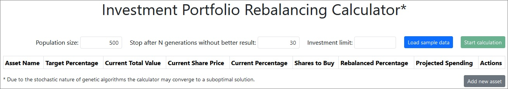
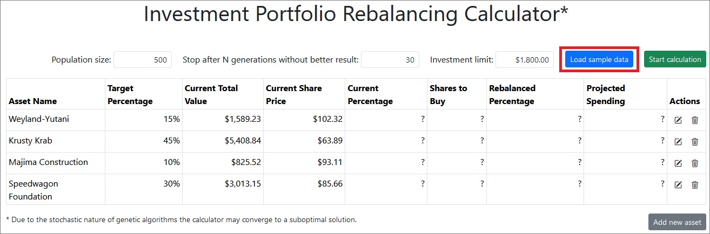

# Investment Portfolio Rebalancing Calculator

Calculates the amount of shares one needs to buy to rebalance an investment portfolio and bring it closer to target allocation while spending as much of the investment as possible. Written in JavaScript. No server needed, works in your browser. Under the hood, the calculator solves the [unbounded knapsack problem](https://en.wikipedia.org/wiki/Knapsack_problem) with a genetic algorithm.

## Dependencies

* [JQuery](https://jquery.com/) 3.7.1
* [Bootstrap](https://getbootstrap.com/) 5.3.3
* [Bootstrap Icons](https://icons.getbootstrap.com/) 1.11.3
* [Jquery Validation](https://jqueryvalidation.org) 1.21.0
* [bignumber.js](https://mikemcl.github.io/bignumber.js/) 9.1.2
* [BSTable](https://github.com/CraftingGamerTom/bstable)
* [CanvasJS](https://canvasjs.com/)
* [QUnit](https://qunitjs.com/) 2.23.0 (tests only)
* Your browser must support [Web Workers](https://developer.mozilla.org/en-US/docs/Web/API/Web_Workers_API)

## Problem

Let's imagine that John Smith decided to invest $1,800 and buy shares of 4 companies. He thought it would be best to allocate his money in the following proportion:

Asset Name | Target Percentage
--- | ---:
Weyland-Yutani | 15%
Krusty Krab | 45%
Majima Construction | 10%
Speedwagon Foundation | 30%

Based on these percentages, Mr. Smith calculated how much money he should spend buying shares of each company. For example, 15% of $1,800 is $270, etc:

Asset Name | Target Percentage | Projected Spending
--- | ---: | ---:
Weyland-Yutani | 15% | $270
Krusty Krab | 45% | $810
Majima Construction | 10% | $180
Speedwagon Foundation | 30% | $540

Mr. Smith looked up each company's share prices and saw nice round values (he was lucky):

Asset Name | Target Percentage | Projected Spending | Current Share Price
--- | ---: | ---: | ---:
Weyland-Yutani | 15% | $270 | $90
Krusty Krab | 45% | $810 | $45
Majima Construction | 10% | $180| $90
Speedwagon Foundation | 30% | $540 | $60

From there, it was obvious to Mr. Smith that if 1 share of a company costs $90, and he can spend $270 on that company, he can buy 3 shares, etc:

Asset Name | Target Percentage | Projected Spending | Current Share Price | Shares to Buy
--- | ---: | ---: | ---: | ---:
Weyland-Yutani | 15% | $270 | $90 | 3
Krusty Krab | 45% | $810 | $45 | 18
Majima Construction | 10% | $180| $90 | 2
Speedwagon Foundation | 30% | $540 | $60 | 9

Mr. Smith bought 3 shares of Weyland-Yutani, 18 shares of Krusty Krab, 2 shares of Majima Construction, and 9 shares of Speedwagon Foundation. He spent all of his $1800, and each asset in his portfolio met the target percentage.

With time, the value of Mr. Smith's portfolio grew, and the asset prices kept changing. Mr. Smith saved up $1,800 more and wanted to invest this money again. However, when he looked at his portfolio, the percentages no longer matched his targets due to asset price changes:

Asset Name | Target Percentage | Current Total Value | Current Share Price | Current Percentage
--- | ---: | ---: | ---: | ---:
Weyland-Yutani | 15% | $1,000.23 | $102.32 | 10.20%
Krusty Krab | 45% | $5,000.84 | $62.89 | 51.02%
Majima Construction | 10% | $800.52| $93.11 | 8.17%
Speedwagon Foundation | 30% | $3,000.15 | $85.66 | 30.61%

Mr. Smith saw that Weyland-Yutani now occupies only 10.20% of his portfolio instead of 15%, Krusty Krab grew to be 51.02% instead of mere 45%, etc. How many shares of each company does he need to buy so that:
1. the percentage of each asset in the portfolio goes back to the target percentage as closely as possible, and 
2. as much as possible is spent of the $1,800?

## Solution

Download this repository and open [index.html](index.html) in your browser:

It doesn't look super interesting, so click on the "Load sample data" button:

We're now seeing the data outlined in the "Problem" section of this readme. Click "Start calculation" and wait for a couple of seconds while the genetic algorithm runs...

The solution says it would be best to buy 7 shares of Weyland-Yutani, 3 shares of Krusty Krab, 4 shares of Majima Construction, and 6 shares of Speedwagon Foundation. This way all but $8.69 of the initial $1800 would be spent.

All assets and their data are editable. New assets can be added, and old assets can be removed.

Since the genetic algorithm is stochastic and is not guaranteed to always converge to the best solution, the calculator may produce more than one solution when run multiple times over identical data. Multiple solutions are stored in memory and can be recalled from the "Load solution..." menu (visible only with 2+ unique solutions, max 5 stored solutions on identical data):

## Tests

QUnit tests are available in the [tests/index.html](tests/index.html) file.
